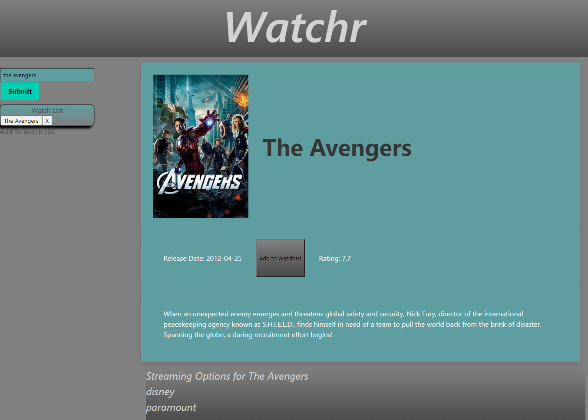

# Watchr
This project is designed to fetch data from the tmdb and streaming availabilty database so a user can get an overview of a movie they searched for and a list of places that the movie can be streamed on. The project can be accessed [here.](https://emthedm.github.io/Pod2-Project-1/)

## Used Technologies
* HTML
* CSS/Bulma
* Javascript/Jquery
* TMDB API
* Streaming Availability API

## Project Features

### Search Bar
The user can enter a movie into the search bar to get information on a particular movie. After the button is clicked, it will fetch the required data from the two APIs.

### Movie Information Display 
After the user uses the search bar, the user will see the information about the movie appear. This information will give them a name, release date, poster image, rating, and plot that is fetched from the TMDB API. Below that the user will be presented with a list of streaming services that the user can watch the movie on that is fetched from the Streaming Availability API.

### Watchlist
There is a button in the upper right corner that the user can click on to add the movie to a watchlist. The watchlist will be saved to local storage and allow the user to access the movie information just by clicking on the item. Items can also be removed by clicking an **X** next to the button.

## Styling
The website uses Bulma for styling. Bulma is a CSS framework that has predefined CSS classes. These classes are used to make a better, nicer, and more responsive user interface.

## License 
MIT 

Copyright 2021 

Permission is hereby granted, free of charge, to any person obtaining a copy of this software and associated documentation files (the "Software"), to deal in the Software without restriction, including without limitation the rights to use, copy, modify, merge, publish, distribute, sublicense, and/or sell copies of the Software, and to permit persons to whom the Software is furnished to do so, subject to the following conditions:

The above copyright notice and this permission notice shall be included in all copies or substantial portions of the Software.

THE SOFTWARE IS PROVIDED "AS IS", WITHOUT WARRANTY OF ANY KIND, EXPRESS OR IMPLIED, INCLUDING BUT NOT LIMITED TO THE WARRANTIES OF MERCHANTABILITY, FITNESS FOR A PARTICULAR PURPOSE AND NONINFRINGEMENT. IN NO EVENT SHALL THE AUTHORS OR COPYRIGHT HOLDERS BE LIABLE FOR ANY CLAIM, DAMAGES OR OTHER LIABILITY, WHETHER IN AN ACTION OF CONTRACT, TORT OR OTHERWISE, ARISING FROM, OUT OF OR IN CONNECTION WITH THE SOFTWARE OR THE USE OR OTHER DEALINGS IN THE SOFTWARE.